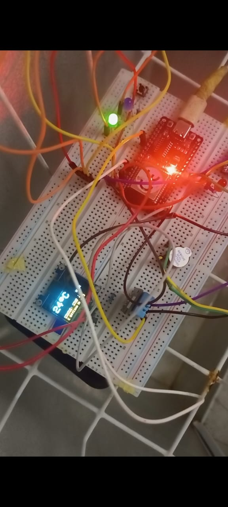

https://github.com/user-attachments/assets/198de071-a69d-483c-9984-370ec2cc8e15

https://github.com/user-attachments/assets/c388a112-6b4d-4dcd-8969-361933d2c3a0

# ESP32 Telegram Climate Monitor

A non-blocking, asynchronous environmental monitoring system built on the standard ESP32 platform. The device tracks ambient temperature and humidity in real-time using a DHT11 sensor, displays live metrics locally on an SSD1306 OLED screen, and utilizes a state-machine with thermal hysteresis to route critical alerts to a Telegram channel.

## Hardware Components
* ESP32 Development Board (Standard Module)
* DHT11 Temperature & Humidity Sensor
* 128x64 I2C OLED Display (SSD1306)
* Hardware Warning Buzzer & Status LEDs (Red, Blue, White)

## Key Technical Features
* **Asynchronous Timing Architecture:** Built entirely with non-blocking `millis()` timing loops instead of hard-coded `delay()` functions. This allows the microcontroller to simultaneously handle sensor polling, display rendering, and network requests without freezing the processor.
* **Thermal Hysteresis Logic:** Implements a state buffer buffer zone (1°C threshold variation) to eliminate fluctuating sensor noise, preventing the system from spamming the Telegram API with repetitive notifications when the room temperature hovers on a boundary line.
* **Secure Web Client Integration:** Utilizes `WiFiClientSecure` to interface safely with the HTTPS Telegram Bot API endpoint, allowing the system to process incoming remote commands like `/status` on demand.

## Current Status
* **Phase 1 (Current):** Fully functional alpha prototype deployed on a physical breadboard setup.
* **Phase 2 (Planned):** Migration to a permanent Vero board circuit layout to enhance mechanical stability and physical packaging.
* ### Project Demonstration
Video playback is available below:

https://github.com/drasca-pel/ESP32-Telegram-Climate-Monitor/blob/main/VID-20260629-WA0009(1).mp4?raw=true
# 🌡️ ESP32 IoT Climate Monitor with Telegram Alerts

A smart, non-blocking environmental monitoring system built on the ESP32. It tracks temperature and humidity using a DHT11 sensor, displays real-time data on an I2C OLED screen using smart hysteresis, and sends instant alerts to a Telegram bot when thresholds are crossed.

---

## 🔌 Hardware Wiring Guide

For a successful setup, connect your components to the ESP32 development board according to the pinouts below. 

### 1. Sensors & Displays
| Component | Component Pin | ESP32 GPIO | Description |
| :--- | :--- | :--- | :--- |
| **DHT11 Sensor** | VCC | **3V3** | 3.3V Power Supply |
| | GND | **GND** | Ground |
| | DATA / OUT | **GPIO 4** | Climate Data Input |
| **SSD1306 OLED** | VCC | **3V3** | 3.3V Power Supply |
| | GND | **GND** | Ground |
| | SDA | **GPIO 21** | I2C Data Line |
| | SCL | **GPIO 22** | I2C Clock Line |

### 2. Indicators & Alerts
| Component | Component Pin | ESP32 GPIO | Connection Requirement |
| :--- | :--- | :--- | :--- |
| **White LED** | Anode (+) | **GPIO 17** | Inline with **220Ω Resistor** (Stable Status) |
| **Blue LED** | Anode (+) | **GPIO 16** | Inline with **220Ω Resistor** (Too Cold Status) |
| **Red LED** | Anode (+) | **GPIO 27** | Inline with **220Ω Resistor** (Too Hot Status) |
| **Active Buzzer** | Positive (+) | **GPIO 26** | Direct connection (Audible Alert) |
| **Common Ground**| Cathode (-) / GND| **GND** | Tie all LED/Buzzer ground legs together |

---
### 🔍 Crucial Hardware Notes

* **DHT11 / DHT22 (4-Pin Sensor Chip):** If you are using the standalone 4-pin sensor chip, you **must** place a **$10\text{ k}\Omega$ resistor** between the **VCC** and **DATA** lines. This pulls the data line high for stable digital communication.
* **DHT11 / DHT22 (3-Pin PCB Module):** If your sensor is already pre-mounted on a small breakout board, you can skip the resistor—the board
* 

### 🎥 Project Demonstration

*(Click the link below the image to watch the full video with sound)*

👉 [Click here to watch the live video demonstration on LinkedIn!](https://www.linkedin.com/posts/adeleye-dara-235579406_iot-esp32-embeddedsystems-ugcPost-7479179852152217600-mZE8/)

https://github.com/user-attachments/assets/930131ac-e4ec-440a-8b62-85158e4bfbf1

[Click here to watch the full video demonstration with sound on LinkedIn!](PASTE_YOUR_NEW_LINKEDIN_POST_URL_HERE)
